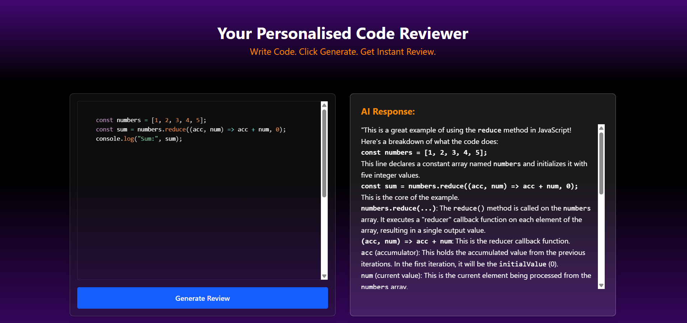

# 💡 AI Code Reviewer

🔗 **Live Site**: [Click here to view live demo](https://ai-code-reviewer-wheat-nine.vercel.app)
<p align="center">
  
</p>

---

Your personalized AI-powered code review tool — Write code, click generate, and get instant suggestions, improvements, and bug detection powered by AI!

---

## 📸 Screenshot


---

## 📁 Project Structure

```
Code_Review/
    ├── Backend/
    │   ├──src
    │   │    ├── controllers/
    │   │    │ └── ai.controller.js 
    │   │    ├── routes/
    │   │    │ └── ai.routes.js 
    │   │    ├── services/
    │   │      └── ai.service.js 
    │   ├── app.js 
    │   ├── server.js 
    │   ├── .gitignore
    │   └── package.json
    ├── Frontend/
    │   ├── src/
    │   │   ├── components/
    │   │   │   ├── Top.jsx
    │   │   │   └── bottom/
    │   │   │       ├── Left.jsx
    │   │   │       └── Right.jsx
    │   │   ├── App.jsx
    │   │   └── main.jsx
    │   ├── public/
    │   ├── .env
    │   ├── vite.config.js
    │   └── package.json
    └── README.md
```

---

## 🚀 Features

- ✅ Real-time AI code reviews using Google Gemini
- ✅ Syntax highlighting with `Prism.js` and `React-Markdown`
- ✅ Mobile-responsive layout (flex + column stacking)
- ✅ Beautiful UI with TailwindCSS and gradient effects
- ✅ Works on phones, tablets, and desktops
- ✅ Ready to deploy (Render + Vercel)

---

## 🧠 Technologies Used

### 🖥️ Frontend (React)
- React + Vite
- Tailwind CSS
- Prism.js
- React-Markdown + remark-gfm
- rehype-highlight

### 🔙 Backend (Node.js + Express)
- Express.js
- CORS
- dotenv
- Google Generative AI SDK

---

## ⚙️ Setup Instructions

### 🔧 Backend (Render)

1. Create a Render account at [https://render.com](https://render.com)
2. Create a **New Web Service**
3. Link your **Backend repo**
4. Add the following environment variables in Render:

   ```
   GOOGLE_GENAI_API_KEY = your_google_api_key
   ```

5. In your `package.json`, ensure this:

   ```json
   "scripts": {
     "start": "node server.js"
   }
   ```

6. Deploy and get your backend URL, e.g.  
   ```
   https://ai-code-reviewer.onrender.com
   ```

---

### 💻 Frontend (Vercel)

1. Go to [https://vercel.com](https://vercel.com)
2. Import your **Frontend repo**
3. Set Environment Variable in Vercel:

   ```
   VITE_BACKEND_URL = https://your-backend-url.onrender.com
   ```

4. Make sure your `vite.config.js` has:

   ```js
   base: "./",
   ```

5. Deploy and you're live!
    ```
    https://ai-code-reviewer-wheat-nine.vercel.app
    ```

---

## 🧪 Local Development

### 🔙 Backend

```bash
cd Backend
npm install
npm run start
```

> Runs on `http://localhost:3000`

---

### 🖥️ Frontend

```bash
cd Frontend
npm install
npm run dev
```

> Runs on `http://localhost:5173`

---

## 🔐 Environment Variables

### Backend

`.env`
```env
GOOGLE_GENAI_API_KEY=your_google_api_key
```

### Frontend

`.env`
```env
VITE_BACKEND_URL=https://your-backend-url.onrender.com
```

---

## 📌 Notes

- Make sure CORS is enabled on the backend for frontend access
- Use `.env` files locally but configure env vars separately on Render/Vercel

---
